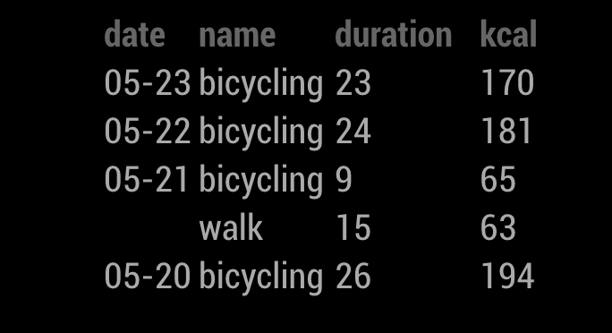
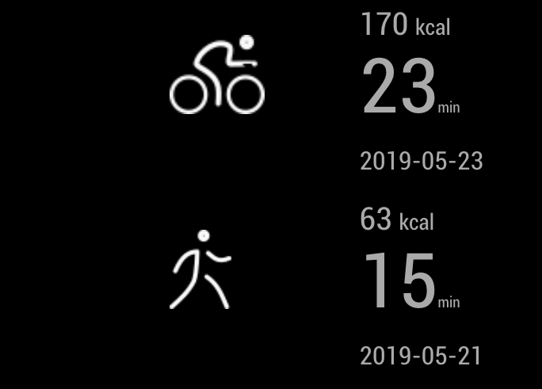

# Module: MMM-withings
**Work In Process**

## Screenshots

|   |   |   |
| - | - | - |
| measurment | list | highlight |
|  |  | |


The `MMM-withings` module is an extension for [MagicMirror](https://github.com/MichMich/MagicMirror). It provides a way to display data (measurements and workouts) from the Withings Health API. Data can be listed or plotted in HTML5 using Chart.js


## Setting Up API Key and User Account

### Needs

1. a withings account
2. Navigate to [here](https://account.withings.com/partner/add_oauth2) to create an application (can be a fake application)
    1. Application Name: Can be anything
    2. Description: Can be anything
    3. Contact Email: Your Email
    4. Callback URL: Your HTTPS website/callback URL or https://example.com
    5. Application Website: Your Website or https://example.com
    6. Company: Your company or whatever you want
    7. Logo: An image file that meets requirements. 'logo.jpg' In this repo works.

Please keep your client ID, client Secret.

### Additionnal steps
Before to get the code then the tokens. I choose to redirect the app to a php file.
```php
<?php
  header("Content-Type: application/json; charset=UTF-8");

  if ( isset($_GET['client_id'])){
    $ch = curl_init();

    curl_setopt($ch, CURLOPT_URL, "https://account.withings.com/oauth2/token");

    curl_setopt($ch, CURLOPT_RETURNTRANSFER, TRUE);

    curl_setopt($ch, CURLOPT_POSTFIELDS, [
      'grant_type' => 'authorization_code',
      'client_id' => $_GET['client_id'],
      'client_secret' => $_GET['client_secret'],
      'code' => $_GET['code'],
      'redirect_uri' => $_GET['redirect_uri']
    ]);

    $rsp = curl_exec($ch);
    curl_close($ch);

    echo $rsp;

  }
  else{
    $json = json_encode(array('code' => $_GET['code']));
    echo $json;
  }
?>
```

This php script will return the tokens in a json. For me this simplify the process to obtain the tokens.

### Go back to config

3. Populate config.js with the clientId, consumerSecret, and redirectUri (the Callback URL):
````javascript
{
    module: "MMM-withings",
    config: {
        clientId: 'deadbeefdeadbeef',
        clientSecret: 'deadbeefdeadbeef',
        redirectUri: 'https://example.com',
    }
},
````
3.b
and prepare the last step by replacing <clientID>, <clientSecret> and <redirectURI>.

```
&client_id=<clientId>&client_secret=<clientSecret>&redirect_uri=<redirectUri>
```

4. Once you have a client ID and consumer secret created, create and navigate to the following website
````url
https://account.withings.com/oauth2_user/authorize2?response_type=code&redirect_uri=https://example.com&scope=user.info,user.metrics,user.activity&state=1&client_id=<your_client_id>
````
5. Login with your account credentials
6. Allow this app
7. You will be redirected to your callback url with a code in the url
E.g.
````url
https://example.com/?state=1&code=deadbeefcafebabe12345789
````
copy the text you did at step 3.b at the end of the url and go to this url. You should get a json file like
```json
{
    "access_token": "aeaeaeae",
    "expires_in": "10800",
    "token_type": "Bearer",
    "scope": "user.info,user.metrics,user.activity",
    "refresh_token": "aeaeaeaieaieiu",
    "userid": "17437932"
}
````
The code is valid only for 30 seconds.
9. Copy this into tokens.json in MMM-withings. Restart magic mirror 2


## Using the module


To use this module, add it to the modules array in the `config/config.js` file:
````javascript
modules: [
    {
        module: "MMM-withings",
        position: "bottom_bar",	// This can be any of the regions.
        config: {
            // See 'Configuration options' for more information.
            units: 'imperial',
            measurements: ['weight', 'fatRatio'],
            workouts: ["bicycling", "swimming"],
            highlights: {
                workouts: ["boxing", "bicycling"]
            }
        }
    }
]
````

## Configuration options

The following properties can be configured:

| Option | Description
| ------ | -----------
| `units` | Units to display<br><br> **Default value:** `config.units`
| `userName` | Name of user<br><br> **Default value:** `MagicMirror`
| `clientId` | Client Id from step 3<br><br> **Default value:** ``
| `clientSecret` | Consumer Secret from step 3<br><br> **Default value:** ``
| `redirectUri` | Callback URL from step 3<br><br> **Default value:** ``
| `initialLoadDelay` | Delay for first check<br><br> **Default value:** `0`
| `updateInterval` | Update interval in milliseconds<br><br> **Default value:** `5 Minutes`
| `daysOfHistory` | Days of data history to fetch<br><br> **Default value:** `14`
| `measurements` | Array of measurements to check<br>**Possible values:** `weight`, `height`, `fatFreeMass`, `fatRatio`, `fatMassWeight`, `diastolicBloodPressure`, `systolicBloodPressure`, `heartPulse`, `temperature`, `sp02`, `bodyTemperature`, `skinTemperature`, `muscleMass`, `hydration`, `boneMass`, `pulseWaveVelocity`<br>**Example:** `['weight', 'fatRatio']`<br>**Default value:** `['weight']`

### View your workouts

#### List your workouts


You can list all your activities track with your watch or the withings health app.

| Option | Description
| ------ | -----------
|`workouts` | Array of workouts to list <br>**Possible values:** see [this](workouts_available.md)
|`workoutLimitPerDay` | The maximum quantily of each workout to list
|`workoutDurationMin` | minimal duration of workout to list (in minute)

#### Highlight certain activities


This image was obtain with this option:

```js
highlight:{
    workouts:["boxe", "bicycling"],
}
```

# TODO

- [ ] separate the request of the display `highlight` from the `list`.
- [ ] add option to change the header
- [ ] add other icons for workout
- [ ] find how to colorize svg via css
- [ ] display Heart Rate in the 4 zones
- [ ] plot Heart Rate
- [ ] Dom is not updated after refreshing the token